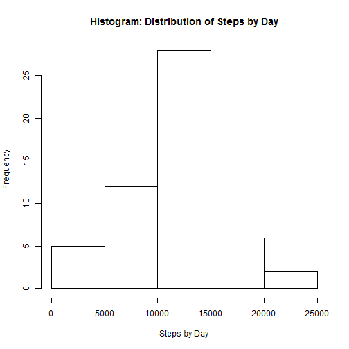
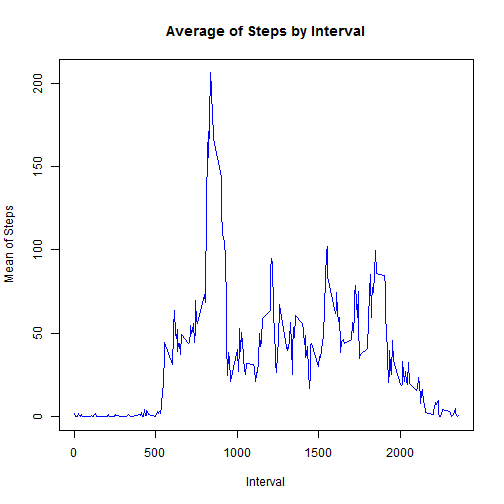
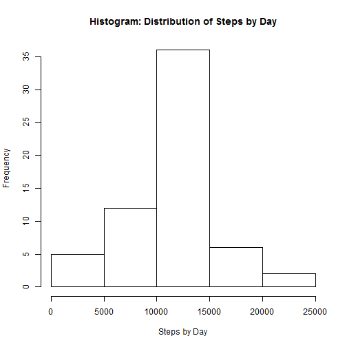
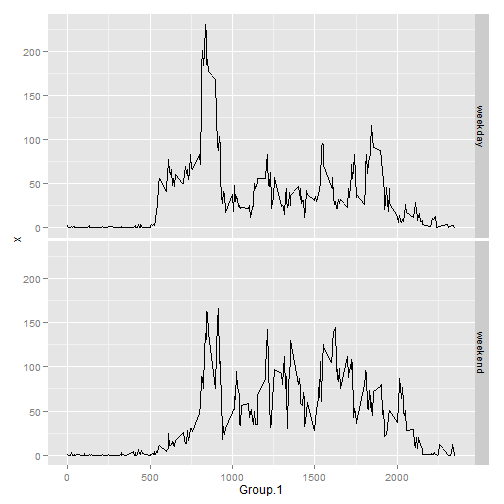

Peer Assessment 1
===========================

What is mean total number of steps taken per day?

A) For this part of the assignment, you can ignore the missing values in the dataset.

1- Make a histogram of the total number of steps taken each day.

The first step is Reading the file.  I used the function read.csv().
In order to construct the Histogram or the total number of steps taken each day, we need to calculate the total amount of steps taken each day, with the function aggregate().  After this, we can graph a histogram that show the distribution of steps by day.


```r
Activity <- read.csv("activity.csv")
StepsByDay <- aggregate(Activity$steps, by = list(Activity$date), FUN = sum)
hist(StepsByDay$x, main="Histogram: Distribution of Steps by Day",xlab="Steps by Day")
```

 

The histogram show, that the most outstanding interval is between 10,000 and 15,000 steps.


2- Calculate and report the mean and median total number of steps taken per day.

The mean and median will be calculated with the function mean() and median().  We can see that the mean is very similar to the median.

MEAN:

```r
mean(StepsByDay$x, na.rm = TRUE)
```

```
## [1] 10766
```

MEDIAN:

```r
median(StepsByDay$x, na.rm = TRUE)
```

```
## [1] 10765
```


__________________________________________


B) What is the average daily activity pattern?


1-  Make a time series plot (i.e. type = "l") of the 5-minute interval (x-axis) and the average number of steps taken, averaged across all days (y-axis)


```r
StepsByInterval <- aggregate(Activity$steps, by = list(Activity$interval), FUN = mean, na.rm = TRUE)
plot(StepsByInterval$Group.1,StepsByInterval$x, type = "l",xlab="Interval",ylab = "Mean of Steps", col="blue", main = "Average of Steps by Interval")
```

 

Analyzing the data in the graph, we can conclude that the peak of activity is in average between the 800 and 900 average.  In the following question is answered the maximum interval.


2-  Which 5-minute interval, on average across all the days in the dataset, contains the maximum number of steps?


```r
StepsByInterval2 <- StepsByInterval
names(StepsByInterval2) <- list("Interval","Average_Steps")
subset(StepsByInterval2, StepsByInterval2$Average_Steps == max(StepsByInterval2$Average_Steps, na.rm = TRUE))
```

```
##     Interval Average_Steps
## 104      835         206.2
```

The 835 interval has on average the maximum number of steps.


___________________________________________

C)  Imputing missing values

Note that there are a number of days/intervals where there are missing values (coded as NA). The presence of missing days may introduce bias into some calculations or summaries of the data.

1-  Calculate and report the total number of missing values in the dataset (i.e. the total number of rows with NAs)

```r
length(Activity$steps[is.na(Activity$steps)])
```

```
## [1] 2304
```
The amount of NA in the Dataset is 2,304.


2-  Devise a strategy for filling in all of the missing values in the dataset. The strategy does not need to be sophisticated. For example, you could use the mean/median for that day, or the mean for that 5-minute interval, etc.

The strategy that I developed, is to fill all missing values with the average of steps, in each interval.  I think in this case, is a good strategy because it will let us to preserve the same structure of the distribution shown in the histogram.

3-  Create a new dataset that is equal to the original dataset but with the missing data filled in.

The first step is to create a dataset with the average of steps by interval (using all days except NA).
The code following the aggregate function, substitute the NAs values with the average, and because all NA correspond to specific days, and the dataset is already sort, we can simply assign the value of the MEAN Data Set to the NA subset.


```r
Activity_Fill <- Activity
StepsByInterval_MEAN <- aggregate(Activity$steps, by = list(Activity$interval), FUN = mean, na.rm = TRUE)
ind <- which(is.na(Activity_Fill), arr.ind=TRUE)
Activity_Fill$steps[ind[,1]] <- StepsByInterval_MEAN$x
```

4-  Make a histogram of the total number of steps taken each day and Calculate and report the mean and median total number of steps taken per day. Do these values differ from the estimates from the first part of the assignment? What is the impact of imputing missing data on the estimates of the total daily number of steps?

```r
StepsByDay_Fill <- aggregate(Activity_Fill$steps, by = list(Activity_Fill$date), FUN = sum)
hist(StepsByDay_Fill$x, main="Histogram: Distribution of Steps by Day",xlab="Steps by Day")
```

 

The distribution of the Filled Dataset is very similar to the original.  This is the reason why I chose the method of the mean to fill the NA´s.

MEAN:

```r
mean(StepsByDay_Fill$x, na.rm = TRUE)
```

```
## [1] 10766
```
MEDIAN:

```r
median(StepsByDay_Fill$x, na.rm = TRUE)
```

```
## [1] 10766
```
The MEAN is exactly the same in the original Dataset, and the Filled Dataset, because I use the mean to calculate the missing values.  In this case, I think, the method of filling missing values is very important, because it could modify the results of the analysis. In my opinion, this should be the less intrusive possible.

The Median change a little, in the filled Data Set, and we can see that the amount is not an integer.  That is because I used decimals as Steps by interval in the filling method.


_______________________________________________________________________________

D)  Are there differences in activity patterns between weekdays and weekends?

For this part the weekdays() function may be of some help here. Use the dataset with the filled-in missing values for this part.

1-  Create a new factor variable in the dataset with two levels - "weekday" and "weekend" indicating whether a given date is a weekday or weekend day.

In the following code, I use a for cycle, in order to create a variable that re-classify all days in Weekend or Weekdays.

```r
Activity_Fill$Weekday <- weekdays(as.Date(Activity_Fill$date))
for (i in 1:17568) {if(Activity_Fill$Weekday[i] == "Sunday" | Activity_Fill$Weekday[i] == "Saturday") Activity_Fill$DayRec[i] <- "weekend" else Activity_Fill$DayRec[i] <- "weekday"}
```


2-  Make a panel plot containing a time series plot (i.e. type = "l") of the 5-minute interval (x-axis) and the average number of steps taken, averaged across all weekday days or weekend days (y-axis). 

```r
StepsByIntervalByDay_MEAN <- aggregate(Activity_Fill$steps, by = list(Activity_Fill$interval, Activity_Fill$DayRec), FUN = mean)
library(ggplot2)
g1 <- ggplot(StepsByIntervalByDay_MEAN, aes(x=Group.1, y=x)) + geom_line(shape=1)
g1 + facet_grid(Group.2 ~ .)
```

 

We can observe in the graph that the activity in the Weekends starts late, comparing weekdays, where we can see that activity begins near the 500 interval.  Weekdays activity starts in average in the interval 700.  This makes sense because, people trend to sleep more on weekends.
